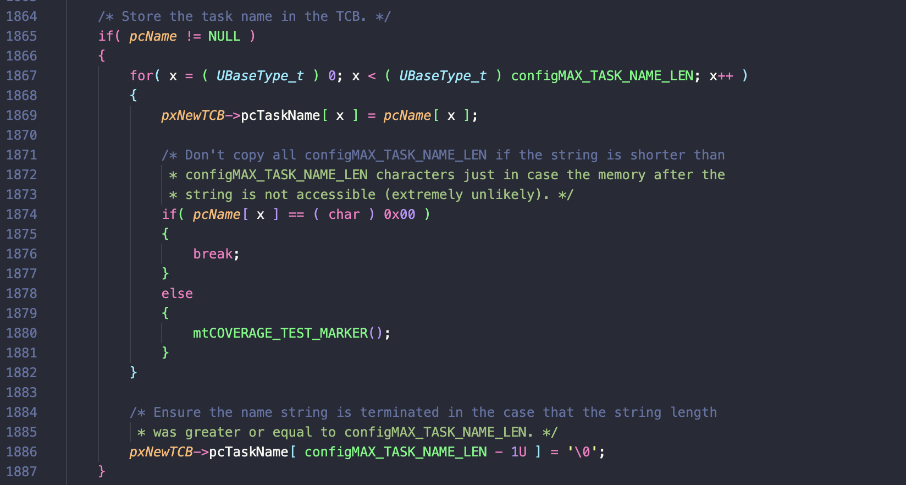

# Fuzzing Demo

## Build

```
make PROFILE=1 SANITIZE_FUZZER=1 USER_DEMO=FUZZ_DEMO SANITIZE_ADDRESS=1
```

## Execution 

```
cd build
./fuzz_demo -max_len=1028 # May need to play around with this
```

## Analysis

### xTaskCreate

This function has the following signature
```
BaseType_t xTaskCreate( TaskFunction_t pxTaskCode,
			const char * const pcName, /*lint !e971 Unqualified char types are allowed for strings and single characters only. */
			const configSTACK_DEPTH_TYPE usStackDepth,
			void * const pvParameters,
			UBaseType_t uxPriority,
			TaskHandle_t * const pxCreatedTask )

```

Out of these inputs began by fuzzing pcName, pvParameters, uxPriority, and uxStackDepth. We found that running 
this through the fuzzer produced an address sanitization error in the `prvInitialiseNewTask` function.

```
INFO: Running with entropic power schedule (0xFF, 100).
INFO: Seed: 3180790347
INFO: Loaded 1 modules   (11192 inline 8-bit counters): 11192 [0xaf8309e4efa0, 0xaf8309e51b58),
INFO: Loaded 1 PC tables (11192 PCs): 11192 [0xaf8309e51b58,0xaf8309e7d6d8),
INFO: A corpus is not provided, starting from an empty corpus
#2	INITED cov: 2 ft: 2 corp: 1/1b exec/s: 0 rss: 32Mb
#1031	NEW    cov: 3 ft: 3 corp: 2/15b lim: 14 exec/s: 0 rss: 33Mb L: 14/14 MS: 4 ChangeBit-CopyPart-CMP-CMP- DE: "\000\000\000\000"-"\001\000\000\000\000\000\000\000"-
=================================================================
==46985==ERROR: AddressSanitizer: heap-buffer-overflow on address 0x50200000889e at pc 0xaf8309d5e030 bp 0xffffe05aea60 sp 0xffffe05aea58
READ of size 1 at 0x50200000889e thread T0
    #0 0xaf8309d5e02c in prvInitialiseNewTask /home/pulitha13/workspace/CSEE-6863/FreeRTOS-Fuzzing/FreeRTOS/Source/tasks.c:1869:41
    #1 0xaf8309d20ed8 in prvCreateTask /home/pulitha13/workspace/CSEE-6863/FreeRTOS-Fuzzing/FreeRTOS/Source/tasks.c:1713:13
    #2 0xaf8309d20b24 in xTaskCreate /home/pulitha13/workspace/CSEE-6863/FreeRTOS-Fuzzing/FreeRTOS/Source/tasks.c:1732:20
    #3 0xaf8309ceb8a4 in LLVMFuzzerTestOneInput /home/pulitha13/workspace/CSEE-6863/FreeRTOS-Fuzzing/FreeRTOS/Demo/Posix_GCC_fuzzing/main_fuzz.c:176:6
    #4 0xaf8309bf69bc in fuzzer::Fuzzer::ExecuteCallback(unsigned char const*, unsigned long) (/home/pulitha13/workspace/CSEE-6863/FreeRTOS-Fuzzing/FreeRTOS/Demo/Posix_GCC_fuzzing/build/fuzz_demo+0xc69bc) (BuildId: 178a3f5dedd6d8491c302765f21dcd4835f9cd78)
    #5 0xaf8309bf6114 in fuzzer::Fuzzer::RunOne(unsigned char const*, unsigned long, bool, fuzzer::InputInfo*, bool, bool*) (/home/pulitha13/workspace/CSEE-6863/FreeRTOS-Fuzzing/FreeRTOS/Demo/Posix_GCC_fuzzing/build/fuzz_demo+0xc6114) (BuildId: 178a3f5dedd6d8491c302765f21dcd4835f9cd78)
    #6 0xaf8309bf78e0 in fuzzer::Fuzzer::MutateAndTestOne() (/home/pulitha13/workspace/CSEE-6863/FreeRTOS-Fuzzing/FreeRTOS/Demo/Posix_GCC_fuzzing/build/fuzz_demo+0xc78e0) (BuildId: 178a3f5dedd6d8491c302765f21dcd4835f9cd78)
    #7 0xaf8309bf8644 in fuzzer::Fuzzer::Loop(std::vector<fuzzer::SizedFile, std::allocator<fuzzer::SizedFile>>&) (/home/pulitha13/workspace/CSEE-6863/FreeRTOS-Fuzzing/FreeRTOS/Demo/Posix_GCC_fuzzing/build/fuzz_demo+0xc8644) (BuildId: 178a3f5dedd6d8491c302765f21dcd4835f9cd78)
    #8 0xaf8309be64e0 in fuzzer::FuzzerDriver(int*, char***, int (*)(unsigned char const*, unsigned long)) (/home/pulitha13/workspace/CSEE-6863/FreeRTOS-Fuzzing/FreeRTOS/Demo/Posix_GCC_fuzzing/build/fuzz_demo+0xb64e0) (BuildId: 178a3f5dedd6d8491c302765f21dcd4835f9cd78)
    #9 0xaf8309c0f344 in main (/home/pulitha13/workspace/CSEE-6863/FreeRTOS-Fuzzing/FreeRTOS/Demo/Posix_GCC_fuzzing/build/fuzz_demo+0xdf344) (BuildId: 178a3f5dedd6d8491c302765f21dcd4835f9cd78)
    #10 0xe0c9060684c0 in __libc_start_call_main csu/../sysdeps/nptl/libc_start_call_main.h:58:16
    #11 0xe0c906068594 in __libc_start_main csu/../csu/libc-start.c:360:3
    #12 0xaf8309bdc7ac in _start (/home/pulitha13/workspace/CSEE-6863/FreeRTOS-Fuzzing/FreeRTOS/Demo/Posix_GCC_fuzzing/build/fuzz_demo+0xac7ac) (BuildId: 178a3f5dedd6d8491c302765f21dcd4835f9cd78)
```

Upon further inspection of the codebase, it looks like that function does not handle the case where the passed in
`char *` in not NULL terminated which is what lead to this particular address sanitization error.



We then added an option to skip fuzzing the string input (-DNO_STRING in main_fuzz.c) to check for any other potential undefined behavior. With these runs libfuzzer was not able to detect any out of memory accesses or undefined behavior. Example output for those runs is below.

```
➜  build git:(main) ✗ ./fuzz_demo -max_len=256 -workers=2 -jobs=4
./fuzz_demo -max_len=256 >fuzz-0.log 2>&1
./fuzz_demo -max_len=256 >fuzz-1.log 2>&1
```

Corresponding Output
```
➜  build git:(main) ✗ cat fuzz-0.log
INFO: Running with entropic power schedule (0xFF, 100).
INFO: Seed: 2967210368
INFO: Loaded 1 modules   (11192 inline 8-bit counters): 11192 [0xbf6569b6efa0, 0xbf6569b71b58),
INFO: Loaded 1 PC tables (11192 PCs): 11192 [0xbf6569b71b58,0xbf6569b9d6d8),
INFO: A corpus is not provided, starting from an empty corpus
#2	INITED cov: 2 ft: 2 corp: 1/1b exec/s: 0 rss: 32Mb
#1033	NEW    cov: 3 ft: 3 corp: 2/13b lim: 14 exec/s: 0 rss: 33Mb L: 12/12 MS: 5 CMP-ChangeBinInt-ChangeByte-CrossOver-InsertRepeatedBytes- DE: "\377\377\377\377"-
==49342== libFuzzer: run interrupted; exiting
➜  build git:(main) ✗ cat fuzz-1.log
INFO: Running with entropic power schedule (0xFF, 100).
INFO: Seed: 2967266283
INFO: Loaded 1 modules   (11192 inline 8-bit counters): 11192 [0xbf0ab022efa0, 0xbf0ab0231b58),
INFO: Loaded 1 PC tables (11192 PCs): 11192 [0xbf0ab0231b58,0xbf0ab025d6d8),
INFO: A corpus is not provided, starting from an empty corpus
#2	INITED cov: 2 ft: 2 corp: 1/1b exec/s: 0 rss: 32Mb
#1075	NEW    cov: 3 ft: 3 corp: 2/13b lim: 14 exec/s: 0 rss: 33Mb L: 12/12 MS: 3 ShuffleBytes-CopyPart-InsertRepeatedBytes-
==49341== libFuzzer: run interrupted; exiting
➜  build git:(main) ✗

```

